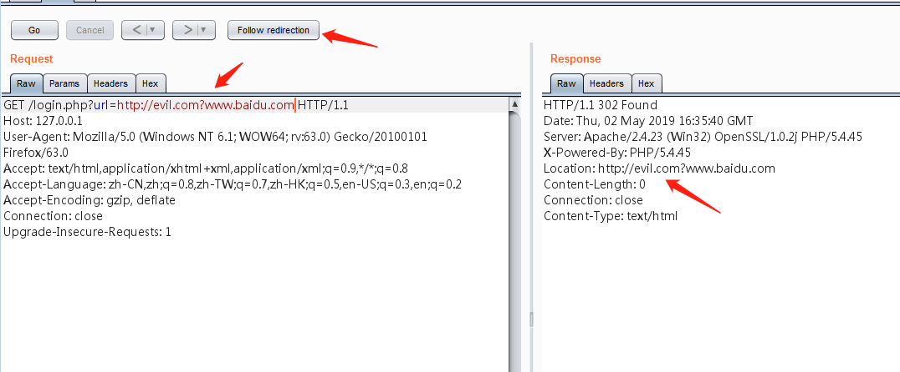
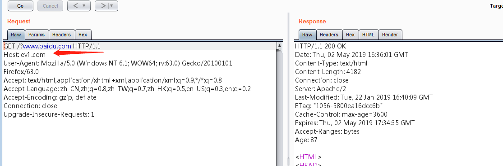

# URL跳转bypass

> 有时候程序上可能对跳转的地址做了限制，可以利用以下的方式绕过对url跳转的限制。

- [问号跳转](#问号跳转)
- [井号跳转](#井号跳转)
- [@跳转](#@跳转)
- [xip.io绕过](#xip.io绕过)
- [反斜杠跳转](#反斜杠跳转)
- [多次跳转](#多次跳转)
- [协议缺失](#协议缺失)

## 问号跳转

​     问号跳转利用http协议的特性来绕过一般的防护，跳转地址为`http://127.0.0.1/login.php?url=http://baidu.com`,使用？问号特性，`http://127.0.0.1/login.php?url=http://evil.com?www.baidu.com`

## 井号跳转

​     跟问号一样，用http协议特性进行跳转

---

## @跳转

火狐浏览器用@跳转会有弹框提示，其他没有。`http://127.0.0.1/login.php?url=http://www.baidu.comm@evil.com`,@后面是你想要跳转的地址。

---

## xip.io绕过

xip.io多数用在SSRF读取内网地址，`http://127.0.0.1/login.php?url=http://www.qq.com.220.181.57.217.xip.io`  当你访问qq这个域名时，其实这个链接已经被解析到后面这个ip地址上了，那么实际访问的就是后面这个IP地址。那个IP地址就是百度的网址

---

## 反斜杠跳转

可以试试`http://127.0.0.1/login.php?url=http://www.evil.com\www.baidu.com`和`http://127.0.0.1/login.php?url=http://www.evil.com\\www.baidu.com`来绕过，因为有可能程序只判断\\\\后面的域名

---

## 多次跳转

绕过厂商允许某些信任的第三方的域名跳转，可以利用他来进行跳转，比如qq允许baidu.com进行跳转可以利用`http://127.0.0.1/login.php?url=http://www.qq.com?url=http:abc.baidu.com?jump=http://evil.com`，他就会去了abc.baidu.com再跳转。

---

## 协议缺失

去掉`http://`协议有可能会绕过`http://127.0.0.1/login.php?url=//www.evel.com`

